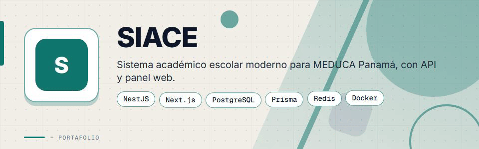
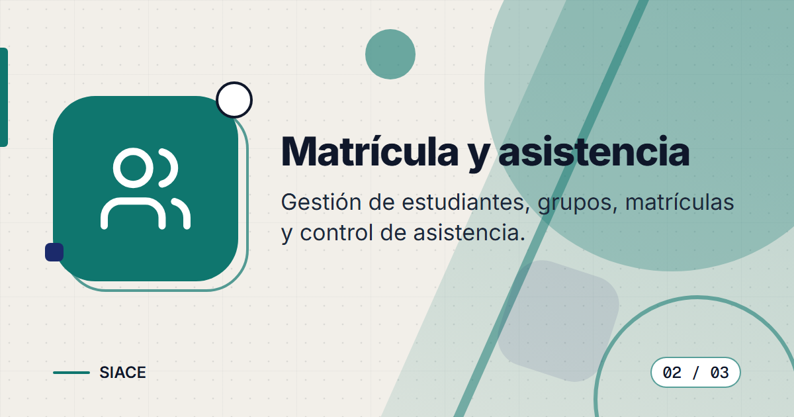
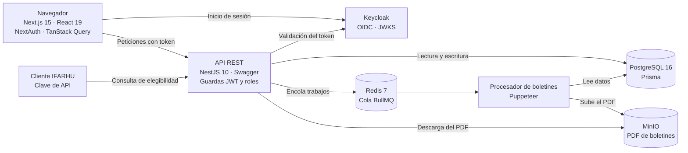

<div align="center">



# SIACE


**Sistema académico escolar para el contexto de MEDUCA (Panamá): matrícula, notas por trimestre, asistencia y boletines en PDF verificables, con acceso por roles y consulta de elegibilidad para IFARHU.**

</div>

> Este es un **portafolio showcase**: el código fuente es propietario y no está incluido.

---

## Contenido

- [El Problema](#el-problema)
- [La Solución](#la-solución)
- [Funcionalidades](#funcionalidades)
- [Vista Previa](#vista-previa)
- [Arquitectura](#arquitectura)
- [Stack Tecnológico](#stack-tecnológico)
- [Instalación local](#instalación-local)
- [Roadmap](#roadmap)
- [Contacto](#contacto)

---

## El Problema

Los centros educativos necesitan llevar sus registros académicos de forma ordenada y confiable:

- Registrar matrícula, notas y asistencia sin hojas de cálculo dispersas.
- Calcular la nota final ponderada por período y saber quién promueve.
- Entregar boletines que se puedan verificar y no se falsifiquen fácilmente.
- Dar a cada persona solo el acceso que le corresponde (docente, secretaría, dirección, ministerio).
- Importar los datos de un sistema anterior sin empezar de cero.

---

## La Solución

Un monorepo con una API REST en NestJS y una aplicación web en Next.js. Centraliza escuelas, años académicos con tres períodos, secciones, matrícula, notas y asistencia, y genera boletines en PDF con un hash de verificación. La autenticación se delega en Keycloak (OIDC) y cada pantalla y endpoint se restringe por rol. Incluye scripts de extracción y carga para importar datos de un sistema legado y una API de elegibilidad protegida con clave para IFARHU.

---

## Funcionalidades

| Funcionalidad | Descripción |
|---------------|-------------|
| Roles y permisos | Cinco roles (`DOCENTE`, `SECRETARIA`, `DIRECTOR`, `ADMIN_MEDUCA`, `IFARHU`) con guardas por endpoint y navegación filtrada por rol |
| Años académicos y períodos | Tres períodos por año, pesos por período y umbral de promoción configurables, con estado de ingreso de notas por período |
| Matrícula y secciones | Alta de grupos por escuela, ofertas de curso y matrícula de estudiantes con estados (activa, retirada, trasladada, graduada) |
| Ingreso de notas | Registro por oferta de curso, plantilla e importación desde Excel, con historial de revisiones por nota |
| Asistencia | Registro masivo (presente, ausente, tarde, excusado) y consulta por matrícula |
| Notas finales | Cálculo de la nota final ponderada por período y determinación de promoción según el umbral |
| Boletines en PDF | Generación individual o masiva en segundo plano (BullMQ y Puppeteer), almacenamiento en MinIO, aprobación y descarga |
| Verificación de boletines | Cada boletín lleva un hash SHA-256 y una URL de verificación |
| Elegibilidad IFARHU | Consulta por cédula con autenticación por clave de API |
| Administración y seguridad | Estadísticas, registros de auditoría, Helmet con CSP y HSTS, CORS restringido y límite de peticiones |

---

## Vista Previa

<table>
  <tr>
    <td width="50%">
      
      <br><b>Notas y boletines</b>: notas por período y boletines en PDF con hash de verificación.
    </td>
    <td width="50%">
      
      <br><b>Matrícula y asistencia</b>: estudiantes por sección y registro masivo de asistencia.
    </td>
  </tr>
  <tr>
    <td width="50%">
      
      <br><b>Acceso seguro</b>: inicio de sesión con Keycloak y permisos por rol.
    </td>
    <td width="50%"></td>
  </tr>
</table>

---

## Arquitectura



**Módulos de la API:** autenticación, escuelas, usuarios, años académicos, cursos, grupos, estudiantes, matrículas, notas, asistencia, boletines, administración e IFARHU. Las rutas llevan el prefijo `/api` con versionado por URI y documentación Swagger.

**Despliegue:** composiciones de Docker para desarrollo, pruebas y producción, esta última con Nginx como proxy.

---

## Stack Tecnológico

| Capa | Tecnología |
|------|-----------|
| Monorepo | pnpm workspaces · Turborepo |
| Frontend | Next.js 15 · React 19 · TypeScript · Tailwind CSS |
| Interfaz | Radix UI · TanStack Query y Table · React Hook Form |
| Autenticación | Keycloak (OIDC) · NextAuth · Passport JWT |
| Backend | NestJS 10 · Swagger · Throttler · Helmet · class-validator · Zod |
| Datos | PostgreSQL 16 · Prisma 5 |
| Colas | Redis 7 · BullMQ |
| Archivos y PDF | MinIO · Puppeteer · xlsx |
| Pruebas | Jest |
| Infraestructura | Docker Compose · Nginx |
| Migración de datos | Scripts en Python |

---

## Instalación local

> **Aviso:** el código es privado y propietario. Estos pasos son solo para colaboradores autorizados con acceso al repositorio.

1. Instala Node.js 20 o superior, pnpm y Docker con el plugin `compose`.
2. Instala las dependencias del monorepo:
   ```bash
   pnpm install
   ```
3. Copia `.env.example` a `.env` y completa tus propios valores.
4. Levanta la infraestructura y los servicios (PostgreSQL, Redis, MinIO, Keycloak, API y web):
   ```bash
   docker compose up -d
   ```
5. Genera el cliente de Prisma, aplica las migraciones y carga los datos semilla:
   ```bash
   pnpm db:generate
   pnpm db:migrate
   pnpm db:seed
   ```
6. Para desarrollar sin contenedores de aplicación:
   ```bash
   pnpm dev
   ```

---

## Roadmap

- [ ] Integración continua con GitHub Actions.
- [ ] Autenticación de múltiples factores (MFA) en Keycloak.
- [ ] Políticas de seguridad por fila (RLS) en PostgreSQL.
- [ ] Pruebas de extremo a extremo con Playwright (inicio de sesión, notas y boletín).
- [ ] Prueba de carga con 50 sesiones concurrentes y cobertura de pruebas de al menos 80 %.

---

## Contacto

El código fuente es propietario. Para consultas o propuestas, escríbeme:

[](mailto:pablozam1931@gmail.com)
[%206517--1870-25D366?style=for-the-badge&logo=whatsapp&logoColor=white)](https://wa.me/50765171870)
[](https://github.com/deadlyrat)

- Correo: [pablozam1931@gmail.com](mailto:pablozam1931@gmail.com)
- WhatsApp: [(507) 6517-1870](https://wa.me/50765171870)
- GitHub: [github.com/deadlyrat](https://github.com/deadlyrat)

---

*Parte del portafolio de [deadlyrat](https://github.com/deadlyrat)*
